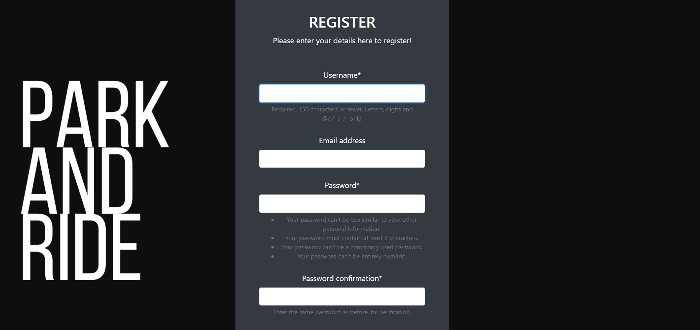
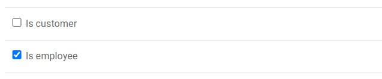
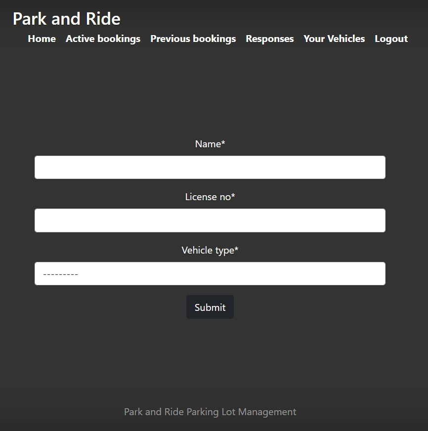
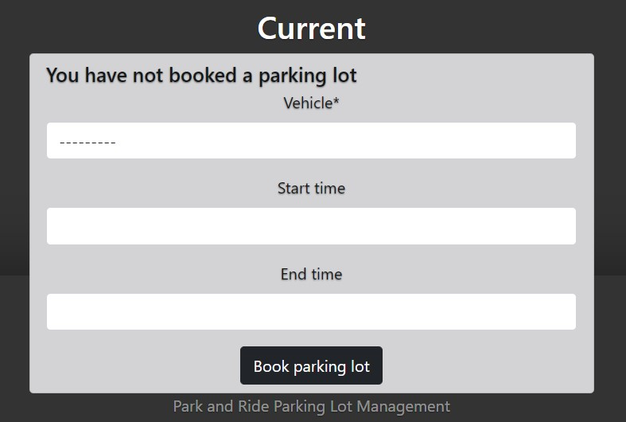
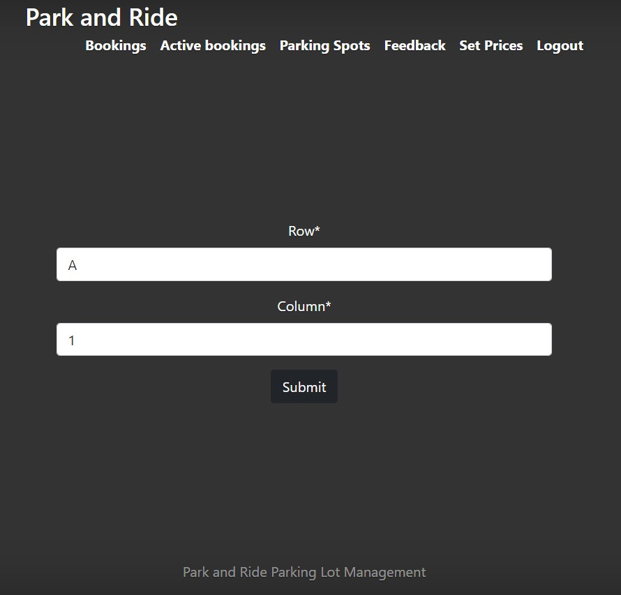

# Park and Ride

# Instructions to run

Extract the zip file to an appropriate location
Run the following commands in the terminal (in windows)
~~~
python -m venv venv
~~~
~~~
venv/Scripts/Activate.ps1 
~~~
~~~
pip install -r requirements.txt
~~~
~~~
python manage.py migrate
~~~
~~~
python manage.py runserver
~~~

Now visit [http://localhost:8000](http://localhost:8000) in a web browser

## Inputs and Expected outputs

### User registration

- Input: Go to [http://localhost:8000/register](http://localhost:8000/register/) and enter the username, password and email address as directed in the form rendered.
- Output: The user is added to the database and the is redirected to the login page.

### Employee Registration 

- The employee registration process is a little more convoluted. Follow the steps in user registration section to register a new customer.

- Run the following command in the terminal to create an admin user
~~~
python manage.py createsuperuser
~~~
- Give a suitable username and password.
- Now, go to [http://localhost:8000/admin](http://localhost:8000/admin) and log in using your admin credentials
- Choose users section, choose the user you most recently made and edit it as shown below.
  
- Now, go to the employee section and create a new employee, choosing the correct user
- Go to the customers section and delete the corresponding customer entry
- Output: An employee entry is added to the database with employee privileges

### Vehicle Registration

- Log in as a customer and go to [http://localhost:8000/add-vehicle/](http://localhost:8000/add-vehicle/). Enter the details of the vehicle as directed in the form and click submit.
  
- Output: A vehicle entry associated to the currently logged in customer is added to the database. The customer can book parking lots with the same.

### Booking Parking Lots

- Log in as customer and go to [http://localhost:8000/](http://localhost:8000/). Input the vehicle and start and end times
- Output: A parking spot is reserved for the user during that period.

### Viewing parking lots

- Log in as an employee and go to http://localhost:8000/business/search-parking-spot/. Input the parking spot number.
- Output: The current occupancy status of the parking lot and the previous bookings of the same

## Inferences

This web application is a parking lot management system which allows users to register their vehicles and book parking lots with them

## Improvements

- Integrate a payment gateway
- Allow users to choose their own parking lots
- Allow different kinds of bookings - permanent, regular etc
